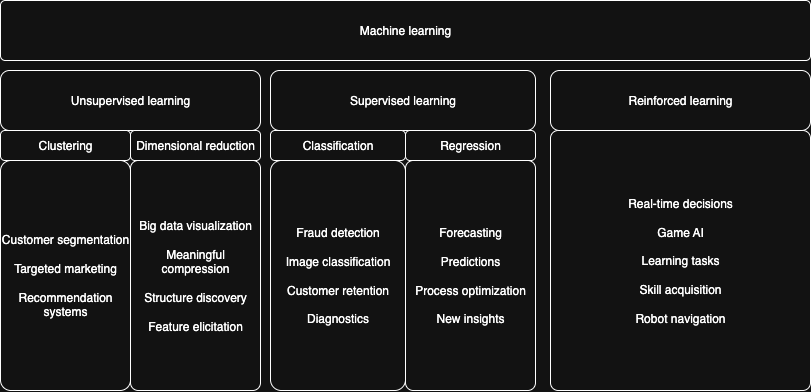

# Strojno učenje
Strojno učenje je podskup umjetne inteligencije (AI) koji se usredotočuje na razvoj algoritama i statističkih modela koji omogućuju računalima obavljanje specifičnih zadataka bez eksplicitnih uputa. Umjesto toga, ti sustavi uče iz podataka i poboljšavaju svoje performanse tijekom vremena kroz iskustvo.

## Unsupervised learning

## Supervised learning

## Reinforced learning

# Usporedba metoda strojnog učenja

| Metoda | Tip zadatka | Linearni / Nelinearni model | Potreba za standardizacijom | Osjetljivost na šum | Tumačivost modela | Parametri koji se podešavaju | Prednosti | Nedostaci |
|:---|:---|:---|:---|:---|:---|:---|:---|:---|
| Linearna regresija | Regresija | Linearni | Da | Visoka | Visoka | Nema (osim regularizacije) | Jednostavna, brza, interpretabilna | Ne radi s nelinearnim odnosima |
| Lasso regresija | Regresija | Linearni (L1) | Da | Umjerena | Umjerena | $\alpha$ (regularizacija) | Odabire značajke (feature selection) | Može eliminirati previše značajki |
| Ridge regresija | Regresija | Linearni (L2) | Da | Umjerena | Umjerena | $\alpha$ | Smanjuje prenaučenost | Ne uklanja značajke |
| SVR | Regresija | Nelinearni (kernel) | Da | Umjerena | Niska | $C$, $\varepsilon$, kernel | Dobar za nelinearne odnose | Spor kod velikih dataseta |
| k-NN-R | Regresija | Nelinearni | Da | Visoka | Niska | $k$, metrika udaljenosti | Jednostavan, bez treniranja | Spor pri predviđanju, osjetljiv na šum |
| Stablo odlučivanja (regresor) | Regresija | Nelinearni | Ne | Umjerena | Visoka | Dubina, min. uzorci | Interpretabilno, brzo | Prenaučenost (overfitting) |
| Random Forest | Oba | Nelinearni (ensemble) | Ne | Niska | Srednja | Broj stabala, dubina | Robustan, smanjuje overfitting | Sporiji, manje interpretabilan |
| AdaBoost | Oba | Nelinearni (ensemble) | Ne | Umjerena | Niska | Broj estimatora, learning rate | Povećava točnost slabih modela | Osjetljiv na šum |
| Gradient Boosting | Oba | Nelinearni (ensemble) | Ne | Umjerena | Niska | Broj estimatora, learning rate, dubina | Vrlo visoka točnost | Spor, može prenaučiti |
| Logistička regresija | Klasifikacija | Linearni | Da | Umjerena | Visoka | Regularizacija, solver | Brza, interpretabilna | Loša za nelinearne odnose |
| Naive Bayes | Klasifikacija | Linearni (probabilistički) | Poželjno | Umjerena | Umjerena | Vrsta distribucije | Vrlo brz, jednostavan | Pretpostavlja neovisnost značajki |
| k-NN-C | Klasifikacija | Nelinearni | Da | Visoka | Niska | $k$, metrika udaljenosti | Jednostavan, bez treniranja | Spor za predikciju, osjetljiv na šum |
| Stablo odlučivanja (klasifikator) | Klasifikacija | Nelinearni | Ne | Umjerena | Visoka | Dubina, kriterij | Intuitivno, interpretabilno | Prenaučenost |
| SVC | Klasifikacija | Nelinearni (kernel) | Da | Umjerena | Niska | $C$, kernel, $\gamma$ | Dobar za male/srednje datasete | Spor kod velikih skupova |
| NuSVC | Klasifikacija | Nelinearni | Da | Umjerena | Niska | $\nu$, kernel | Alternativa SVC-u | Teže tumačiti $\nu$ |
| Diskriminantna analiza | Klasifikacija | Linearni / kvadratni | Da | Umjerena | Visoka | Vrsta (LDA/QDA) | Dobar za normalne distribucije | Loš ako pretpostavke nisu zadovoljene |

## Resources
[Supervised vs unsupervised learning](https://www.youtube.com/watch?v=SYPejHY9WV8)